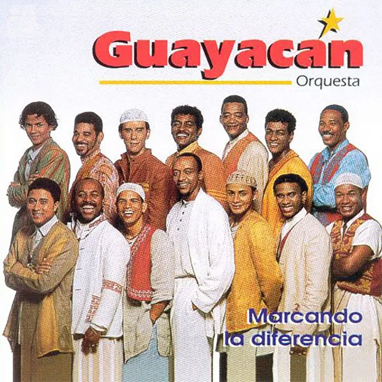
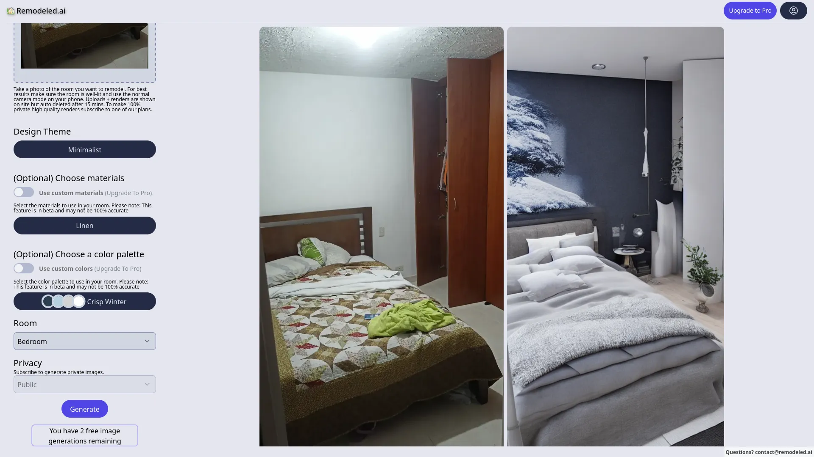

.. title:: Usando AI para tus metas

.. footer::

    .. raw:: html
        
        

        

            
            
Ing. Pedro Rivera 

        

        
<a class="ftLink" href="https://co.linkedin.com/in/ppsirg" target="_blank" >LinkedIn</a> - <a href="https://github.com/ppsirg" target="_blank" class="ftLink">Github</a>

        
Liderazo Extraordinario Coomeva, 2023

        

:css: css/base.css

----

Usando AI para tus metas
=============================

.. note::

    preguntar que piensan que es inteligencia artificial, decirle a la gente que 
    les puedo explicar la inteligencia artificial con una cancion de guayacan

----

Que es la AI
=============================

"CUANDO HABLAN LAS MIRADAS"

.. raw:: html

    <audio controls ><source src='audio/ai_guayacan.mp3' type="audio/mp3" ></audio>

.. note::

    una ia es esencialmente dos maquinas, una que genera contenido para hacerlo pasar
    por correcto y otra que juzga si un contenido es correcto, cuando la primera 
    engaña a la segunda se obtiene lo que se desea que haga la AI

----

Que es la AI
=============================

"CUANDO HABLAN LAS MIRADAS"

.. raw:: html

    <audio controls ><source src='audio/ai_guayacan.mp3' type="audio/mp3" ></audio>

Contexto (la situacion)
---------------------------

.. raw:: html
    
    

    
    tomame de la mano dulcemente, 
    acercate a mi, yo quiero hablarte de amor
     
    

Orden (lo que quiero que hagas)
-----------------------------------

.. raw:: html
    
    

    
    dime aunque sea mentiras que me amas, por favor,
     
    

    

Modificador (cosas que pueden cambiar como se responde a la orden)
-----------------------------------------------------------------------

.. raw:: html
    
    

    
    quiero apoyarte contra mi pecho, aunque quizas no llegue a tu lecho
     
    

    

----

Que cosas puede hacer una IA
=============================

- clasificar
- predecir

`There is an AI for that <https://theresanaiforthat.com/>`_

----

Usemos nuestra primera AI
=============================

`Forefront.ai <https://chat.forefront.ai/>`_

----

Que es un prompt
=============================

.. raw:: html
    
    
actuando como un veterinario experto en gatos 
    pequeños de pelo largo, escribe una lista de 
    consejos para cuidar a un gato angora turco de dos años con sobrepeso,
    centrese en los consejos de dieta y ejercicio

.. raw:: html

    <button id="promptcopyButtonA" class="copyTextBtn">Copiar texto</button>
    

----

Trucos - contexto
=============================

- el contexto deberia tener:
  - que tipo de "persona artificial quiero que responda"
  - información importante para desarrollar la tarea
- detenerse a pensar en que es lo importante para el contexto
- si no sabe del contexto, que la AI le ayude a construirlo:

.. raw:: html
    
    

    
    actuando como un experto en negocios internacionales entre latinoamerica y estados unidos en el sector de alimentos, 
    
    que informacion necesita para ayudarme a crear una estrategia para lograr que mi negocio exporte frutas exoticas a estados unidos desde colombia,
    

.. raw:: html

    <button id="promptcopyButtonB" class="copyTextBtn">Copiar texto</button>
    

----

Trucos - orden
=============================

- use verbos claros de manera imperativa
- trate de usar términos técnicos correctos
- use palabras claves para evitar los indeterminados

.. raw:: html
    
    

    
    Actuando como un consultor de marketing con experiencia trabajando con instituciones educativas de niños de basica primaria,  
    
    escribe una lista de los 5 temas mas relevantes tenidos en cuenta por los padres de niños de basica primaria al momento de elegir escuela,
    
    para cada uno de los temas relevantes escribe un parrafo detallando la razon de la importancia del tema para los padres y que desean los padres encontrar en una escuela basica primaria sobre esos temas relevantes
    
    

.. raw:: html

    <button id="promptcopyButtonC" class="copyTextBtn">Copiar texto</button>
    

----

Trucos - modificadores
=============================

- dependen mucho de las capacidades de la AI que estes usando
- describe el enfoque de la tarea o su proposito

.. raw:: html
    
    

    
    actuando como un historiador experto en la historia de la economia,  
    
    realiza una tabla sobre los 5 principales economistas de la corriente libertaria,
    
    la tabla debe contener sus nombres, fecha de nacimiento, fecha de fallecimiento y el titulo de su libro mas representativo
    
    

.. raw:: html

    <button id="promptcopyButtonE" class="copyTextBtn">Copiar texto</button>
    

----

Caso estudio: Diseño de marca
==============================

`Namelix <https://namelix.com>`_

----

Caso estudio: Pitch
=============================

.. raw:: html
    
    

    
    actuando como un consultor de negocios experto en emprendimientos de colombia,  
    
    que informacion necesita de mi negocio para poder ayudarme a crear un pitch de 1 minuto
    

.. raw:: html

    <button id="promptcopyButtonD" class="copyTextBtn">Copiar texto</button>
    

----

Bonus: Crea imagenes
=====================================

`Craiyon <https://www.craiyon.com/>`_

.. raw:: html

    

    
    
    
    

----

Bonus: Crea páginas web
=====================================

`Framer <https://www.framer.com/>`_

----

Bonus: Rediseña tu casa
=============================

`Remodeled AI <https://remodeled.ai/>`_ --
`Interior ideas <https://app.interiorideas.ai/>`_ --
`Reimagine home <https://www.reimaginehome.ai>`_

----

Notas finales
=============================

- las respuestas de la AI son inventadas, pueden ser falsas
- las AI no tienen repetitividad asegurada
- las AI tienen sesgos y es lo más natural
- la habilidad del humano pasa de hacer a calificar el trabajo de la AI
- las AI se pueden hackear, cuidado con eso
- hay debates éticos sobre a quien pertenece la propiedad intelectual de algo que hace una AI
- usted puede estar filtrando datos de su empresa usando AI
- trata de escribir prompts con un estilo similar al del internet

----

